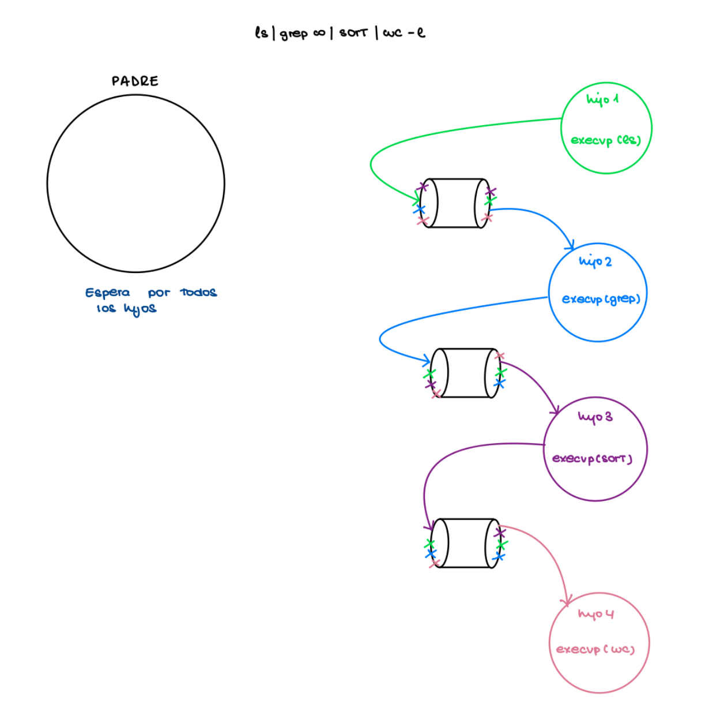

## ENUNCIADO PRÁCTICA
#### DESCRIPCIÓN

En esta práctica se abordará el problema de implementar un programa que actúe como intérprete de mandatos. El
minishell a implementar debe interpretar y ejecutar mandatos leyéndolos de la entrada estándar. En definitiva debe
ser capaz de:
- Ejecutar una secuencia de uno o varios mandatos separados por el carácter ‘|’.
- Permitir redirecciones:
    - Entrada: < fichero. Sólo puede realizarse sobre el primer mandato del pipe.
    - Salida: > fichero. Sólo puede realizarse sobre el último mandato del pipe.
    - Error: >& fichero. Sólo puede realizarse sobre el último mandato del pipe.
- Permitir la ejecución en background de la secuencia de mandatos si termina con el carácter ‘&’. Para ello, el minishell debe mostrar el pid del proceso por el que espera entre corchetes, y no bloquearse por la ejecución de dicho mandato (es decir, no debe esperar a su terminación para mostrar el prompt).

A grandes rasgos, el programa tiene que hacer lo siguiente:
- Mostrar en pantalla un prompt (los símbolos msh> seguidos de un espacio).
- Leer una línea del teclado.
- Analizarla utilizando la librería parser (ver apéndice).
- Ejecutar todos los mandatos de la línea a la vez creando varios procesos hijo y comunicando unos con otros con las tuberías que sean necesarias, y realizando las redirecciones que sean necesarias. En caso de que no se ejecute en background, se espera a que todos los mandatos hayan finalizado para volver a mostrar el prompt y repetir el proceso.

Teniendo en cuenta lo siguiente:
- Si la línea introducida no contiene ningún mandato o se ejecuta el mandato en background, se volverá a mostrar el prompt a la espera de una nueva línea.
- Si alguno de los mandatos a ejecutar no existe, el programa debe mostrar el error “mandato: No se encuentra el mandato”
- Si se produce algún error al abrir cualquiera de los ficheros de las redirecciones, debe mostrarse el error “fichero: Error. Descripción del error”
- Ni el minishell ni los procesos en background deben finalizar al recibir las señal desde teclado SIGINT (Ctrl-C) mientras que los procesos que se lancen deben actuar ante ella, manteniendo la acción por defecto.

#### OBJETIVOS PARCIALES

    1. Ser capaz de reconocer y ejecutar en foreground líneas con un solo mandato y 0 o más argumentos.

    2. Ser capaz de reconocer y ejecutar en foreground líneas con un solo mandato y 0 o más argumentos, redirección de entrada estándar desde archivo y redirección de salida a archivo.

    3. Ser capaz de reconocer y ejecutar en foreground líneas con dos mandatos con sus respectivos argumentos, enlazados con ‘|’, y posible redirección de entrada estándar desde archivo y redirección de salida a archivo.

    4. Ser capaz de reconocer y ejecutar en foreground líneas con más de dos mandatos con sus respectivos argumentos, enlazados con ‘|’, redirección de entrada estándar desde archivo y redirección de salida a archivo.

    5. Ser capaz de ejecutar el mandato cd (0,5 puntos). Mientras que la mayoría de los mandatos son programas del sistema, cd es un mandato interno que debe ofrecer el propio intérprete de mandatos. El mandato cd debe permitir tanto el acceso a través de rutas absolutas como relativas, además de la posibilidad de acceder al directorio especificado en la variable HOME si no recibe ningún argumento, escribiendo la ruta absoluta del nuevo directorio actual de trabajo. Para el correcto cambio de directorio el mandato cd se debe ejecutar sin pipes.

    6. Ser capaz de reconocer y ejecutar tanto en foreground como en background líneas con más de dos mandatos con sus respectivos argumentos, enlazados con ‘|’, redirección de entrada estándar desde archivo y redirección de salida a archivo. Para su correcta demostración, se deben realizar los mandatos internos jobs y fg:

        - jobs: Muestra la lista de procesos que se están ejecutando en segundo plano en la minishell (no es necesario considerar aquellos procesos pausados con Ctrl-D).
        - fg: Reanuda la ejecución del proceso en background identificado por el número obtenido en el mandato jobs, indicando el mandato que se está ejecutando. Reorienta su entrada estándar y salidas estándar a la terminal del usuario. Si no se le pasa ningún identificador se pasa a foreground el último mandato en background introducido.

    7. Evitar que los comandos lanzados en background y el minishell mueran al enviar la señal desde el teclado SIGINT, mientras los procesos en foreground respondan ante ella. La minishell deberá mostrar una nueva línea y un nuevo prompt cuando reciba dicha señal

    8. Ser capaz de ejecutar el mandato exit (0,5 puntos). exit es un mandato interno que cuando se ejecuta la minishell termina de manera ordenada y se muestra el prompt de la Shell desde dónde se ejecutó.

    9. Ser capaz de ejecutar el mandato umask (1 punto). La máscara del modo de creación de un fichero de usuario (umask) se usa para determinar los permisos de un fichero cuando se crea nuevo. Por tanto, este mandato se utiliza para establecer dichos permisos por defecto para ficheros nuevos. El mandato admite dos formatos. Para esta práctica sólo se pide que el mandato programado acepte un número octal (por ejemplo, 0174). Los permisos por defecto que se establezcan serán el resultado de la resta bitwise del número octal pasado como argumento al mandato.

#### NORMAS DE ESTILO
La práctica se evaluará comprobando el correcto funcionamiento de los distintos objetivos, y valorando la simplicidad
del código, los comentarios, la óptima gestión de recursos, la gestión de errores y la calidad de la memoria. El profesor
podrá solicitar una defensa oral de la práctica si lo considerase necesario.
A la hora de codificar la solución pedida, se deberán respetar una serie de normas de estilo:
- Las variables locales de las funciones se declararán inmediatamente después de la llave de comienzo del cuerpo de la misma. Se penalizará la declaración de variables entre sentencias ejecutables de las funciones.
- No se admitirán asignaciones iniciales a variables cuyo valor dependa del valor de otras variables. El valor asignado en estos casos siempre deberá ser conocido en tiempo de compilación.
- Cuando se declare una variable de tipo array, su tamaño deberá ser conocido en tiempo de compilación. Si se quiere utilizar un array de tamaño variable, deberá crearse en memoria dinámica mediante las funciones
correspondientes (malloc, calloc o realloc). La memoria dinámica solicitada deberá liberarse (free) antes de
salir del programa.
- Las operaciones sobre strings (copia, comparación, duplicación, concatenación, etc) se realizarán en lo posible mediante las funciones indicadas en string.h (ver referencias a la biblioteca de C en el Campus Virtual).
- En general, se penalizará el uso de construcciones propias de C++.
- Al compilar el código fuente, deberá producirse el menor número posible de warnings (mejor que no se produzca ninguno).

## IMAGEN FUNCIONAMIENTO PIPES


## COMPILACIÓN Y EJECUCIÓN

```
gcc -Wall -Wextra myshell.c libparser.a -o myshell
./myshell
```
